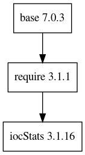

# Deprecation notice

2020-08-20: This remote has been deprecated. Moved to https://gitlab.esss.lu.se/e3/common/e3-iocStats.

e3-iocStats
==

||
| :---: |
|**Figure 1** iocStats Depdendency Tree. |

## ESS Site-Specific Database
Due to latest EPICS base changes, we cannot use the vanilla iocAdminSoft.substitutions. Thus, we have to introduce the ESS site-specific one, such as iocAdminSoft-ess.substitutions. That file is converted to iocAdminSoft-ess.db, and will be installed the e3-iocStats installation location. And the corresponding iocStats.iocsh contains that file, so no other actions are necessary. 

There are very special PVs within E3 IOCSH environment, which can give us important information on required modules name and its version. Each iocsh.bash has the unique PV PREFIX is defined when we run IOC. Without Channel finder service, it is cumbersome to detect PVs. With the latest iocsh.bash, it will be accessible through `$(IOCNAME):E3_IOCSH_PREF`

For example,
```
$ caget SEC-SUB01:DIS-DEV-01-IocStats:E3_IOCSH_PREF
SEC-SUB01:DIS-DEV-01-IocStats:E3_IOCSH_PREF REQUIRE:b02bfff-hadron-30459

$ caget REQMOD:b02bfff-hadron-30459:MODULES
REQMOD:b02bfff-hadron-30459:MODULES 5 require sequencer sscan calc iocStats

$ caget REQMOD:b02bfff-hadron-30459:VERSIONS
REQMOD:b02bfff-hadron-30459:VERSIONS 5 3.1.2 2.2.7 2.11.3 3.7.3 3.1.16
```

We can build a central service to collect these PVs through Channel Finder service, after this with few algorithm, we can identify which module, and its corresponding version are used in where on the fly. This will give us an extremely easy tool to maintain E3 in a long term. 

